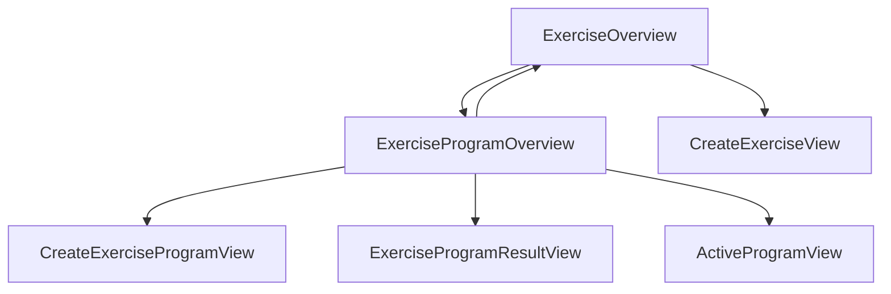

# MistyStep

## UserStories

### General explanatory User Stories

- As a user I want an app that let's me create custom exercise programs and track my progress, so that I can improve my physical fitness.
- As a user I want there to be a point based tracking system, so I can setup goals for my self in the form of point-based ranges. eg. 1000-1200 points equals middle pshysiqe
- As a developer I want to keep the user data locally, so there is no GDPR compliance to take into consideration.
- As a user I want the app to primarily work on a mobile-phone, so that I can use it everywhere.
  
### Must have User Stories

- As a user I want to create custom exercises I can add to an exercise program, so I can customize my workout.
- As a user I want every exercise to have a "point per repetition" possibility, so I can define the difficulty of an exercise.
- As a user I want to create custom exercise programs, so I can add exercises to them.
- As a user I want to track records on an exercise program level, so I can follow my progress.
- As a user I want to add a exercise timer on the exercise program, so there is a pause between every exercise.
- As a user I want a result page for a specific workout, so I can get an overview of all the exercises and their final point result.

### Could have User Stories

- As a user I want the exercise timer to make a little chime when the time is up.

## Diagrams

### Current flow

